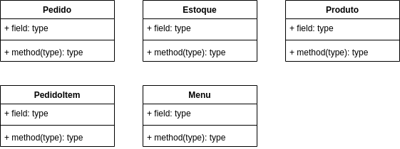

# Desafio - Sistema Ponto de Venda (PoS - Point of Sale)

O Sistema Ponto de Venda (PoS - Point of Sale) simula um módulo de frente de caixa de supermercado integrado com o respectivo cadastro de produtos, controlando também seus estoques, em que baixas são dadas sempre que uma venda é concluída.

## Visão geral



## Getting started

### Pré-requisitos

- [Java SE Development Kit 11](https://www.oracle.com/br/java/technologies/downloads/#java11) ou superior

### Workspace

O workspace contém a seguinte estrutura:

```shell
.
├── bin
├── lib
├── resources
└── src
    └── Utils
```

- `bin` - Local da *saída* da compilação
- `lib` - Local das dependências de projeto
- `resources` - Local de arquivos utilitários (ex.: arquivos de dados)
- `src` - Local dos arquivos de código fonte da codebase

> [!NOTE]
> - `lib` não existirá se o projeto não tiver dependências
> - `bin` não é versionado, logo só existirá *localmente*, conforme especificado abaixo

### Executando o projeto

#### 1. Via terminal de comandos

Criar o diretório `bin` se ele já não existir
```shell
mkdir bin
```
> [!NOTE]
> O comando de criação de diretório pode variar dependendo do SO

Compilar os arquivos de código fonte de `src` para dentro do diretório `bin`
```shell
javac -cp "src" -d "bin" src/App.java
```
Executar a classe `App` (main) compilada dentro do diretório `bin`
```shell
java -cp "bin" App
```

## Enunciado do desafio
